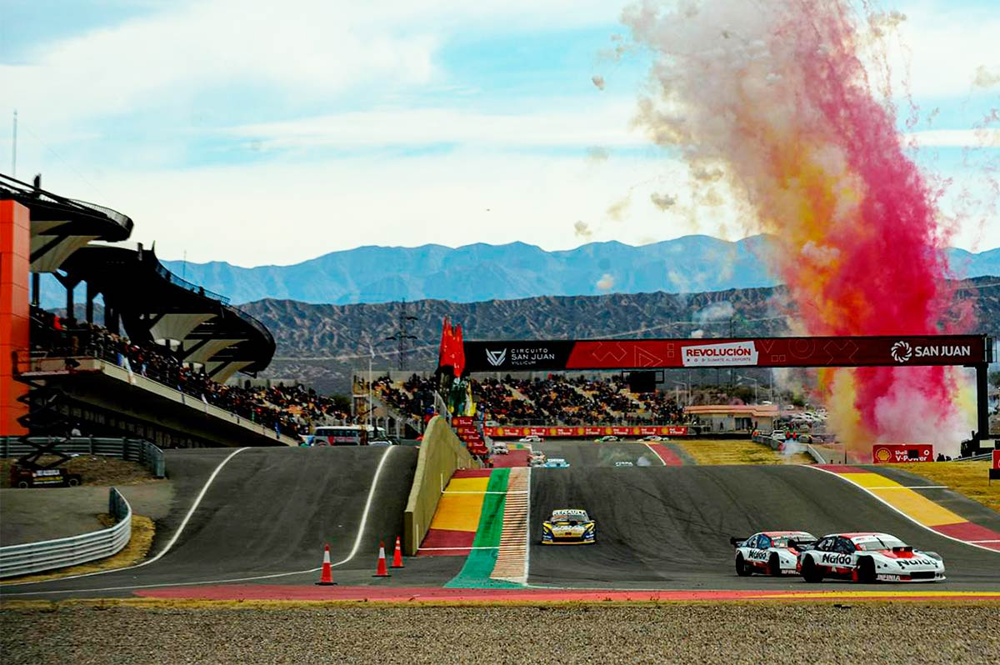

El [circuito San Juan Villicum](https://es.wikipedia.org/wiki/Circuito_San_Juan_Villicum) es un autódromo internacional ubicado en la provincia de San Juan, Argentina. Tiene una longitud de 4.254 metros. Presenta constantes subidas y bajadas a lo largo del trazado, generadas artificialmente con un movimiento de suelo superior a los 700 000 m³.

En este circuito se celebran carreras como:
* Campeonato mundial de Superbikes
* Turismo Carretera
* TC200
* Entre otros...

# Construcción de Race-control

> Race control: Son las oficinas donde están tanto los jueces de la competencia, en ese lugar no solo pueden ver las cámaras de todo el circuito, sino también les llegan los datos de todos los vehículos y pueden determinar sanciones, apercibimientos, etc.

Interacción realizo la construcción del Race control en este autódromo.

---

#infraestructura

#automatización

#Construcción