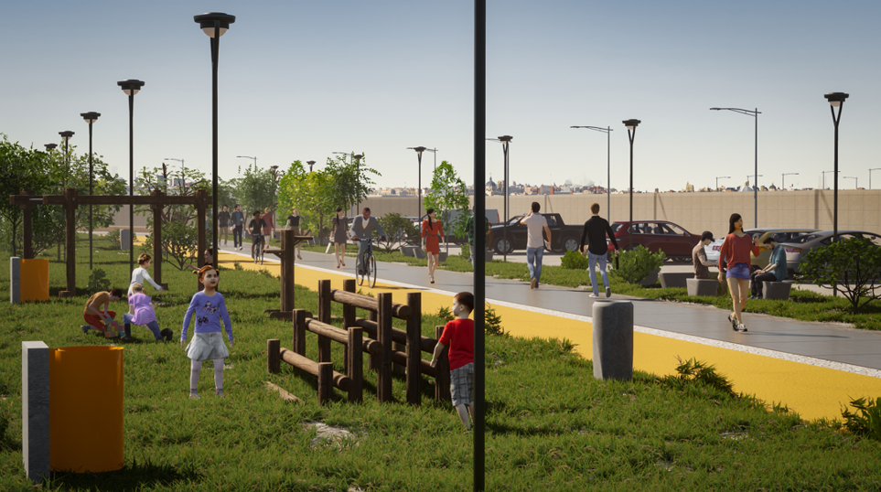
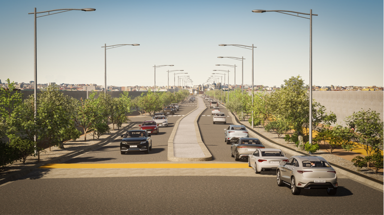

El canal Benavidez, es un canal de riego en la provincia de San Juan. 

# Solución de Interacción

En el marco de ampliación del canal, Interacción hizo una propuesta de mejora que, dejando al canal de la misma calidad, ademas de ahorrar 50 millones de dolares, generaba otros beneficios como: 

* Menos expropiaciones de terrenos y no se erradicaron asentamientos.
* Contempla la futura ciudad judicial y sus alrededores.
* Mantiene el diseño urbanístico de todo el sistema
* Incorpora el Partidor Necochea al diseño
* Al diseño se le incorpora estructuras que deben mantenerse
* Tres estaciones Generadoras
* Obra de Cruce Bajo ruta 40
* Da continuidad a una ciclovía en toda la obra
* Satisfacer los caudales previstos en cada punto solicitados por Hidráulica

---
#arquitectura

#hidráulica

#infraestructura