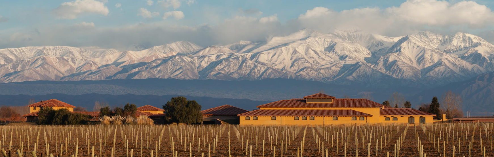
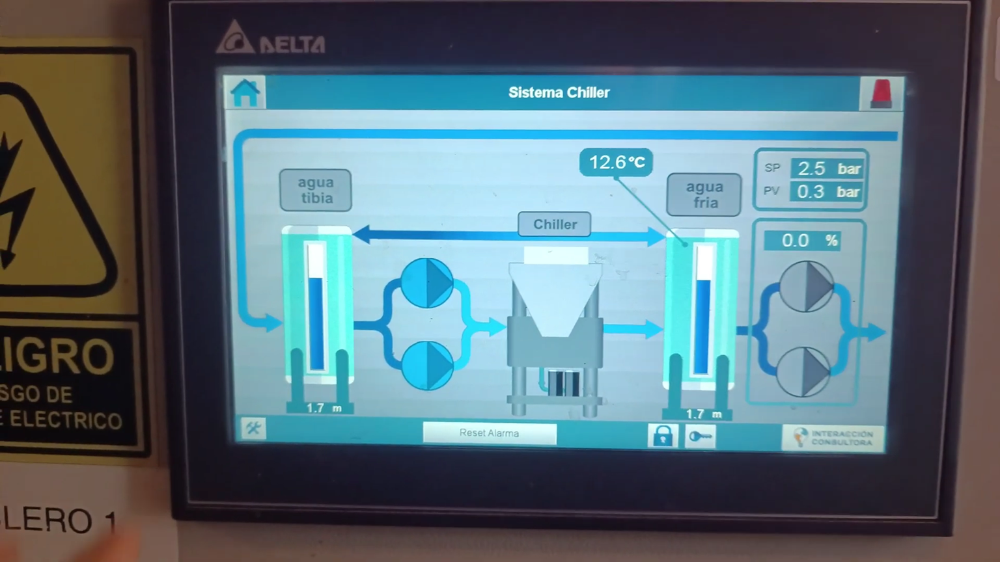
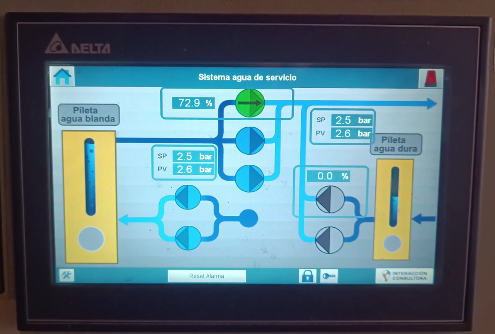

En la Bodega Decero, ubicada en Lujan, Mendoza, tienen entre sus equipos, un sistema de bombas que provee:

* Agua caliente
* Agua de refrigeración
* Agua para servicios generales

Este sistema, lamentablemente requería mucha precencia del operador de la bodega, por lo que se decidió automatizar mediante un PLC para que este pueda enfocarse en otras partes de la instalación.

Se le coloco una interfaz intuitiva y modos manual/automático ya que es un sistema que requiere versatilidad en su utilización.

---

   #automatización #Bodega #Electromecanica #PLC #HMI
