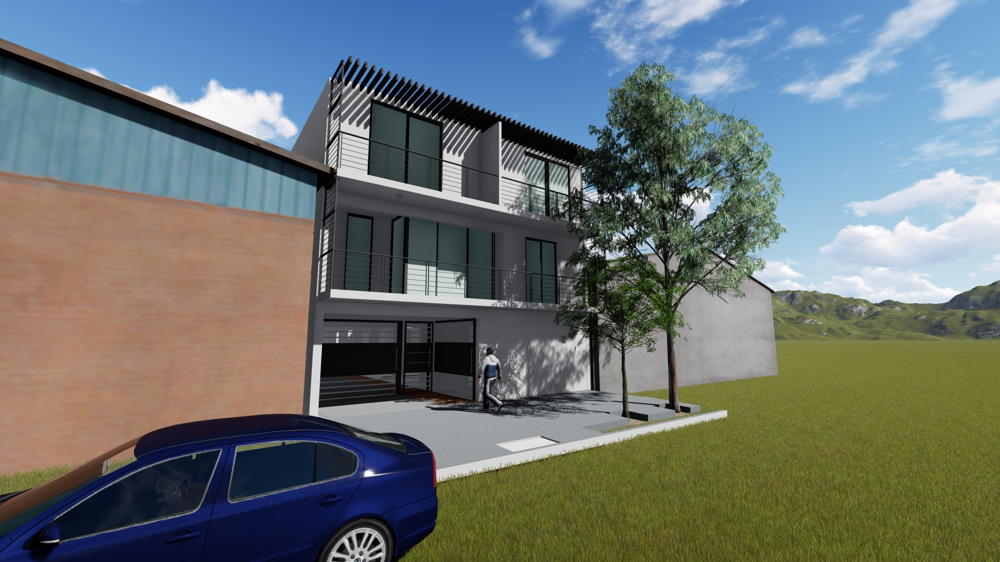

En Mendoza, Godoy cruz, se esta levantando un complejo de departamentos en el cual, el proyecto completo desde el desarrollo hasta la construcción lo esta llevando a cabo Interacción consultora.

El proyecto contempla la ejecución de un conjunto de departamentos que incluye dos unidades de 90 m², con amplios espacios y dos dormitorios cada una, y cuatro departamentos de 45 m², de un dormitorio, diseñados para ofrecer confort y funcionalidad.

**Tareas realizadas:**  
Se llevaron a cabo todas las etapas del proyecto, desde el diseño arquitectónico hasta la ejecución de la obra. Actualmente, el complejo se encuentra en la etapa final, abocado a los últimos detalles de terminación.

---
#arquitectura  #Construcción