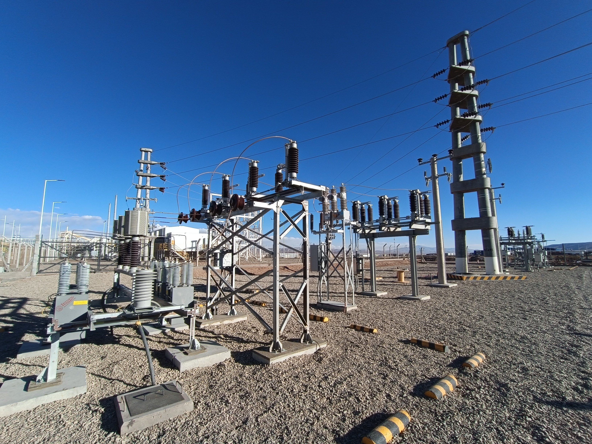

En la minera de Litio de Exar, en Jujuy, se nescesitaba colocar un equipamiento de capacitores para una linea de media tension. Este equipamiento contaba de:

* Capacitores
* 2 Seccionador de linea no aptos para trabajar bajo carga
* 1 seccionador de linea apto para trabajar bajo carga
* Tablero de automatizacion del sistema
* 2 Tablero de apertura de rejas
* Cerraduras electromagnéticas de rejas

Al trabajar con media tension, es de vital importancia que el sistema no este energizado cuando la gente entra al recinto por mantenimiento, por lo que se trabajo en los enclavamientos para evitar la apertura de puertas o cerrado de circuitos en momentos indebidos, asi como en la puesta en marcha del sistema. 

---
#automatización #mineria #Electromecanica