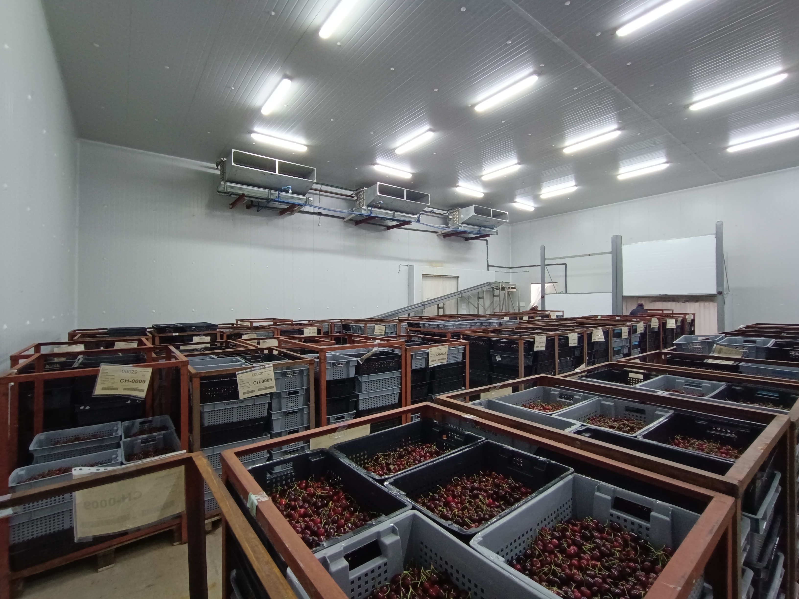
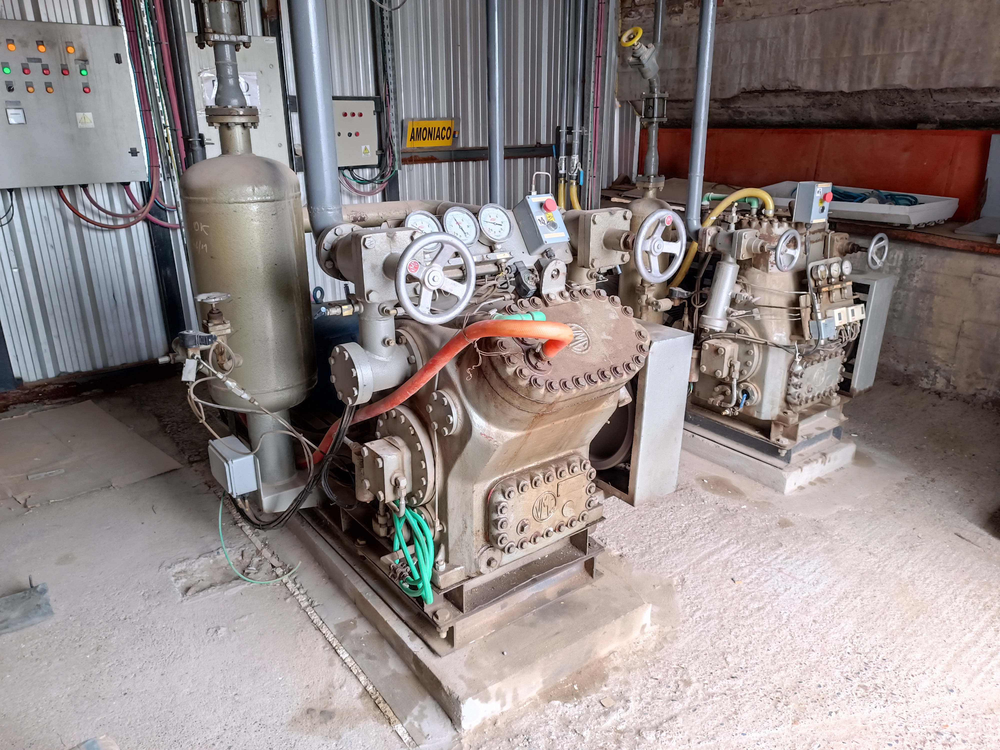
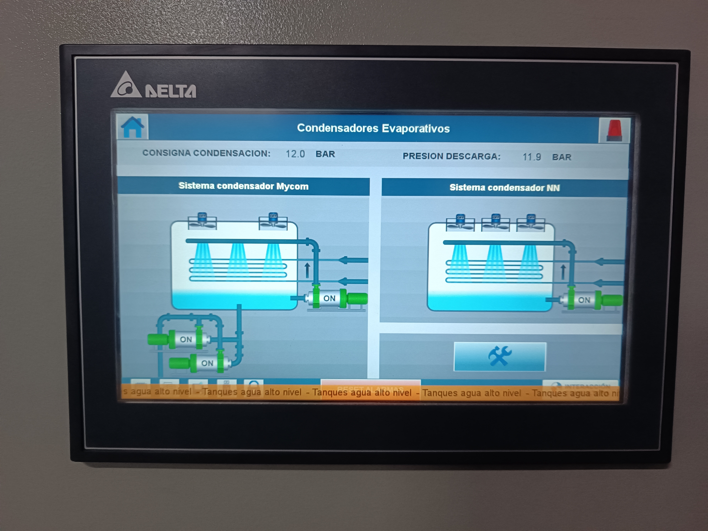
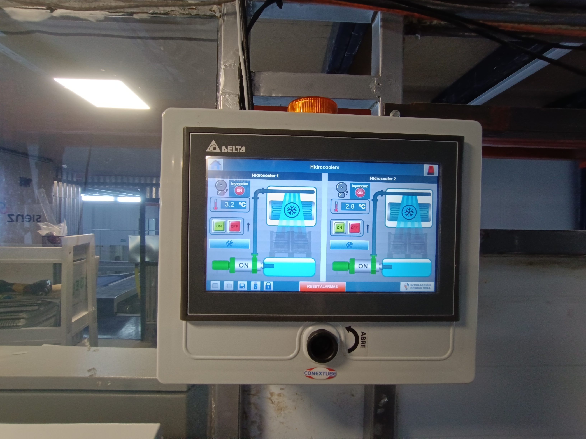

El frigorífico de Coop. de productores intergados de cereza de Gaiman LTD esta ubicado en Gaiman, un departamento de Chubut ubicado a 15Km de Trelew.

Es un frigorífico de cerezas para exportación, el cual posee 3 cámaras y varios intercambiadores por agua.

# Sala de máquinas

En la sala de maquinas se contaba con 3 compresores a piston, los cuales fueron completamente automatizados con un PLC y 2 HMIs.

# HMI

---

 #Automatizacion #Frio #Frigorifico #Electromecanica #PLC #HMI
