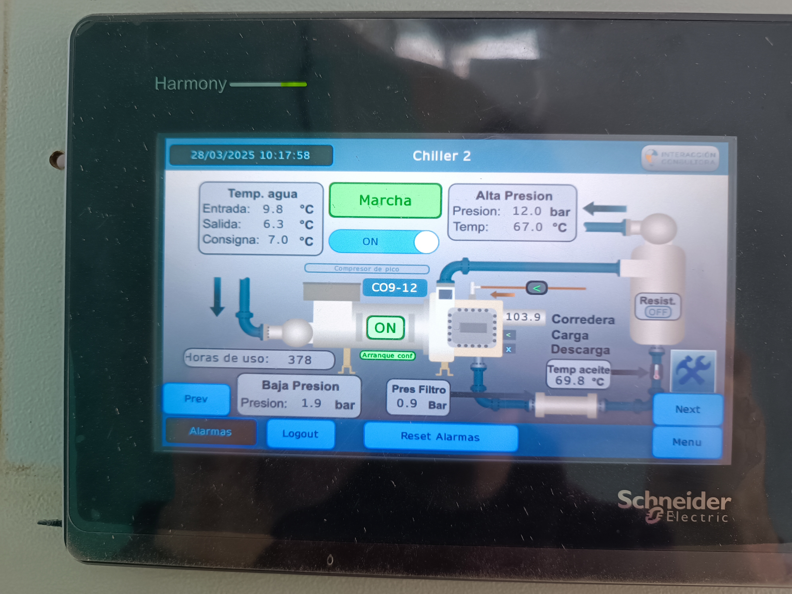
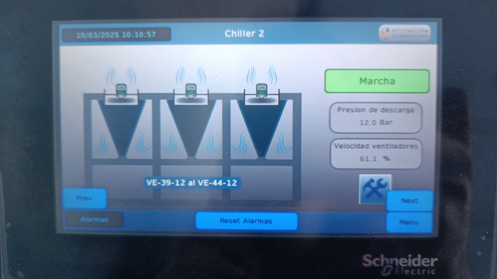
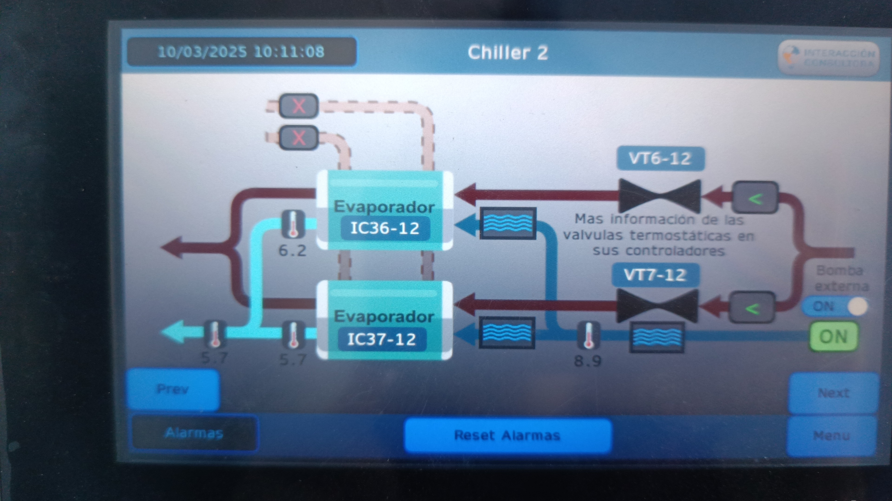

En la casa de maquinas de la bodega se contaba con 2 chillers de agua con una automatizacion antigua que fue responsable de la quema de un compresor.

Se trabajo en el arreglo del compresor y en la instalacion de una nueva automatizacion con PLC y HMI.

# HMI

---
 #Frigorifico #Frio #Electromecanica #automatización #PLC #HMI
