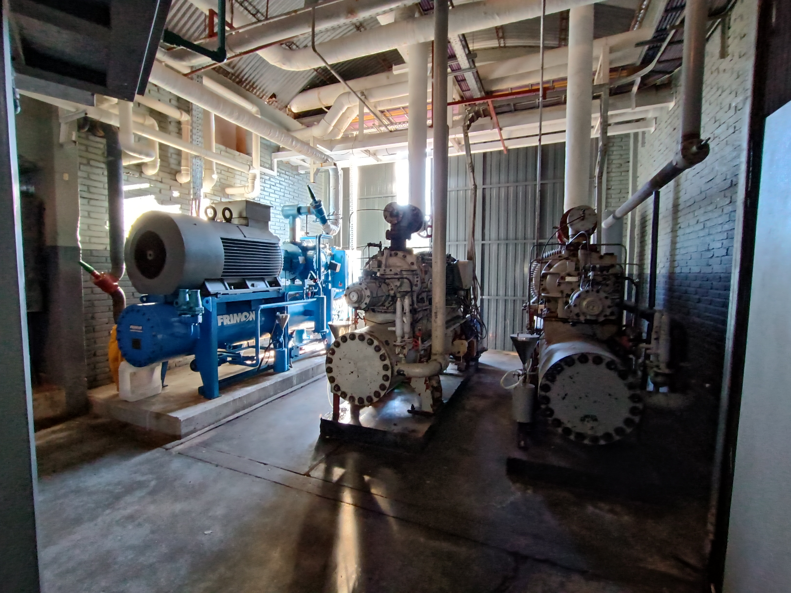

En la casa de maquinas de la bodega se contaba con 2 compresores a tornillo Kobelco con una potencia de 300Hp instalados en el año 2001. Ademas contaban con un compresor mas nuevo marca Vilter el cual tiene su propia automatización.  

De estos equipos, uno se intercambio por un compresor nuevo marca Magicawa-Mycom. La automatizacion realizada por Interacción Consultora controla estos últimos 2 compresores a tornillos en conjunto con todos los demás componentes de circuito frigorífico.

---
 #Frigorifico #Frio #Electromecanica #automatización #PLC #HMI
