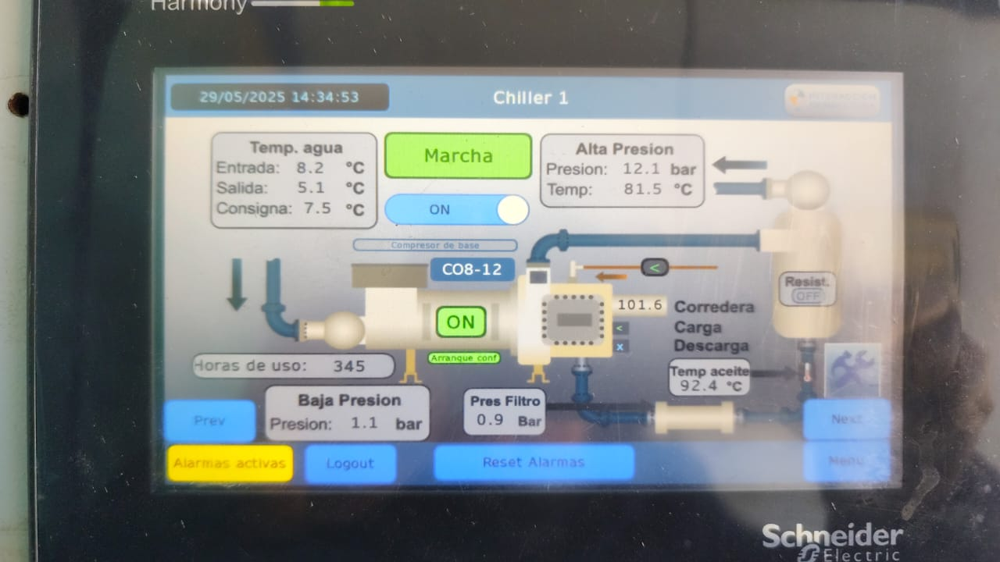

Los equipos presentaban problemas en sus componentes debido a problemas en la automatización.

El primer trabajo fue el de diagnosticar los componentes de las maquinas, estos son:

* Compresores
* Evaporadores
* Cantidad de refrigerantes
* entre otros...

# Arreglos frigoríficos

Se procedió con el cambio de algunas partes con la nescesaria adaptación ya que comercialmente no se conseguian los mismos componentes.

# Automatización

Se le cambio el PLC y su HMI por una de primera calidad. Se le agrego una interfaz intuitiva que contaba con:

* Rápida visualización de estado de equipos, entradas y salidas
* Registro de avisos y alarmas
* Sistema de claves de seguridad para modificar parámetros
* entre otros...

---
# Frio #Electromecanica #automatización #PLC #HMI
